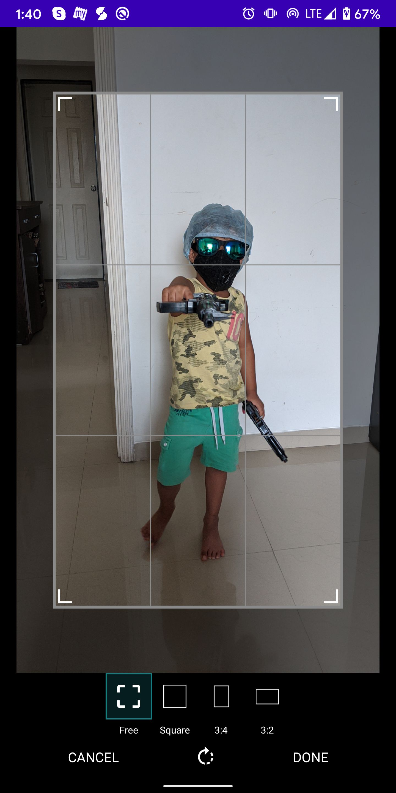
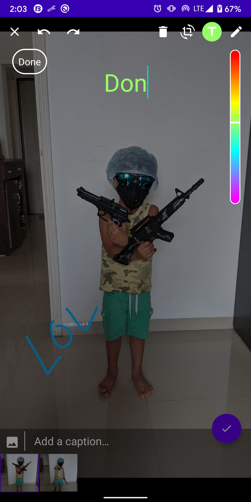
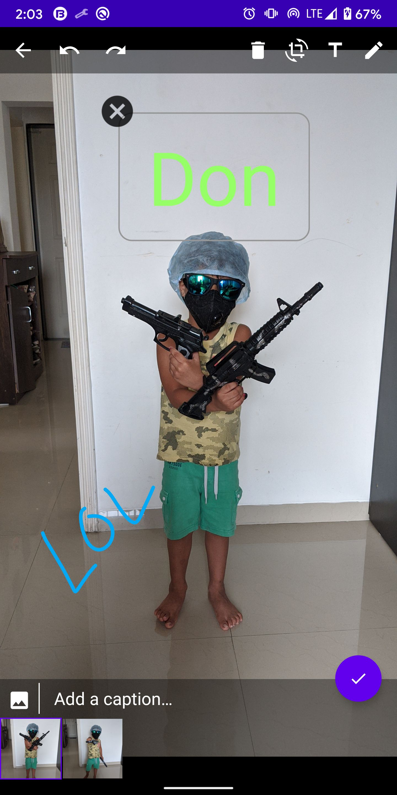

# PicEditor (WhatsApp Style Image Editor)
PixEditor is a Whatsapp image Editor replica. with this, you can integrate an image editor just like WhatsApp.

## Usage:

``` 
      mEditOptions = EditOptions.init().apply {
            mRequestCode = PIC_IMAGE_EDITOR_CODE
            mAddMoreImplementedListener = mAddMoreListener
            showCaption = true
            isCaptionCompulsory = true
            mWatermarkType = WatermarkType.DATE
        }
        
```

Use onActivityResult method to get results

``` 
    override fun onActivityResult(requestCode: Int, resultCode: Int, data: Intent?) {
        super.onActivityResult(requestCode, resultCode, data)

        if (resultCode == Activity.RESULT_OK && requestCode == mEditOptions.mRequestCode){
            @Suppress("UNCHECKED_CAST")
            val mEditedList = data?.getSerializableExtra(EDITED_MEDIA_LIST) as ArrayList<MediaFinal>?
            //EditedList is your final output list
           
            mEditOptions.mSelectedImageList = ArrayList()
        }
    }
```

Do check the sample to understand proper & easy implementation.

## Screenshots

<p float="left">
  
  
  
  
</p>

## Libraries

* [PhotoView] 
* [PhotoEditor]


License
-------

    Copyright 2020 Parag Pawar

    Licensed under the Apache License, Version 2.0 (the "License");
    you may not use this file except in compliance with the License.
    You may obtain a copy of the License at

       http://www.apache.org/licenses/LICENSE-2.0

    Unless required by applicable law or agreed to in writing, software
    distributed under the License is distributed on an "AS IS" BASIS,
    WITHOUT WARRANTIES OR CONDITIONS OF ANY KIND, either express or implied.
    See the License for the specific language governing permissions and
    limitations under the License.

[PhotoView]: <https://github.com/chrisbanes/PhotoView>
[PhotoEditor]: <https://github.com/burhanrashid52/PhotoEditor>
